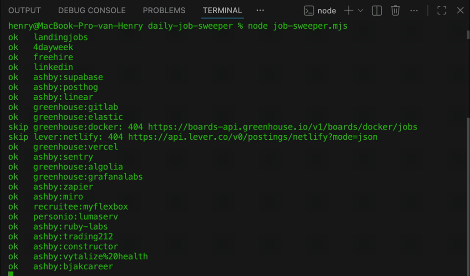
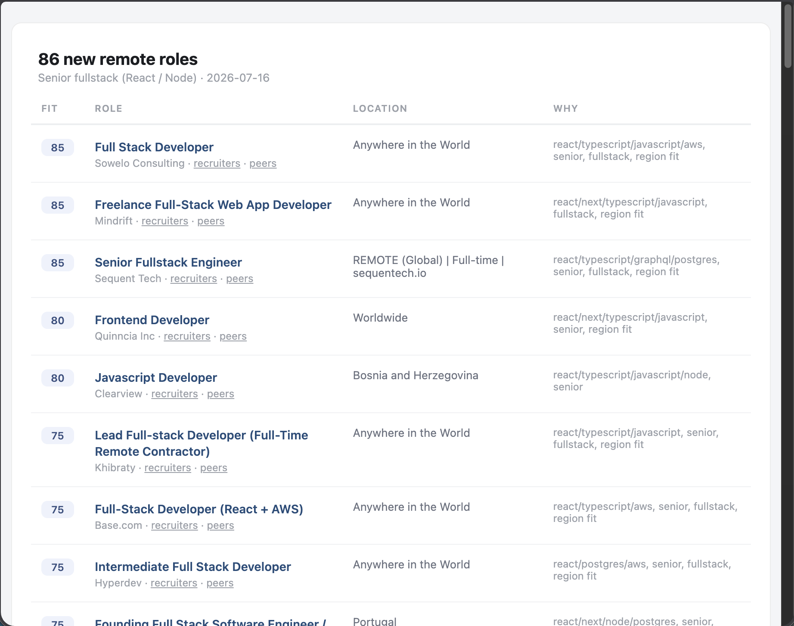

# daily-job-sweeper

Daily automated sweep for remote dev jobs that fit your profile. One file, zero dependencies, Node 18+.

<p align="center">
  
</p>

The morning email — every new match ranked, with a one-line "why it fits":

<p align="center">
  
</p>

It queries a dozen public job APIs and per-company ATS boards, filters to your stack, seniority, and region, drops stale and off-stack noise, collapses duplicates across sources, and prints a ranked shortlist with a one-line "why it fits" note. Run it from a terminal, or let the included GitHub Action run it every morning and email you the shortlist.

## What it does

- **Multi-source sweep** — aggregators that need no company list (RemoteOK, Remotive, Jobicy, Himalayas, Arbeitnow, Working Nomads, WeWorkRemotely, Remotely, hiring.cafe, freehire.dev, HN "Who is hiring?", EU Remote Jobs, Jobspresso, NoDesk, Landing.jobs, 4dayweek.io, LinkedIn*) plus direct ATS APIs for companies you name (Greenhouse, Lever, Ashby, and best-effort Recruitee, SmartRecruiters, Workable, Personio).
- **ATS fingerprinting** — list company slugs in `COMPANY_SLUGS`; on first run each is probed against every supported ATS to detect which one it uses. Hits join the watchlist, misses are cached so each slug is only probed once.
- **Self-growing watchlist** — any ATS link spotted in an aggregator feed (`boards.greenhouse.io/…`, `*.recruitee.com`, …) is added to the watchlist automatically. The sweep gets broader the longer it runs.
- **Cross-source dedupe** — the same role is collapsed across sources by canonical URL *and* by company + normalized title (stack words stripped, so "Full-Stack, React/Node" equals "Full Stack (React/Node)"), always preferring the company's own posting over an aggregator repost.
- **Region filtering** — a posting must show a signal that it's workable from your region (in its location, tags, or description, or via timezone restrictions). Bare "Remote", other-continent-only, and single-other-country roles are dropped.
- **Fit scoring** — stack keywords, seniority, fullstack signal, and company-site source raise the score; roles whose real stack is elsewhere (Vue/Django/Rails/… without your keywords) are penalized and labelled `off-stack`.
- **Intermediary filtering** — reposts by agencies and talent marketplaces are hidden by default; `--resolve` follows aggregator links to the real company posting.

\* LinkedIn uses the public jobs-guest endpoint, local runs only (skipped in CI), personal-use volume — see the note in the adapter.

A note on scope: ATS platforms only expose per-company job-board APIs — there is no public "search all of Ashby/Greenhouse" endpoint. So `SEED_WATCHLIST` is a warm start, not the boundary: hiring.cafe and freehire.dev already index jobs across those ATS platforms globally, and every ATS link the aggregators surface is added to your watchlist, so that company's board is swept directly from then on.

## Quickstart

```bash
cp profile.example.config.mjs profile.config.mjs   # then edit: your stack, region, companies
node job-sweeper.mjs
```

Flags:

```bash
node job-sweeper.mjs             # sweep, print + persist new matches
node job-sweeper.mjs --resolve   # also resolve aggregator links to the real company URL (slower)
node job-sweeper.mjs --selftest  # validate filtering/dedupe/parsers offline (no network)
```

State files are created next to the script on first run (all gitignored):

| File | Purpose |
| --- | --- |
| `seen.json` | URLs already reported, so you only ever see new roles |
| `applied.json` | company names you've applied to (or ruled out); never resurfaced. Maintain by hand |
| `watchlist.json` | ATS company tokens; auto-grows from aggregator apply-links |
| `fingerprinted.json` | company slugs already probed, so each is fingerprinted only once |
| `matches.csv` | append-only log of everything surfaced |
| `matches.html` | styled table of the latest run (used as the email body) |

(`ranked/` is also gitignored — a free scratch directory for your own notes on top of `matches.csv`.)

## Run it daily with the included GitHub Action

The workflow in `.github/workflows/sweep.yml` runs the sweep every morning, emails you the shortlist when there's something new, and commits the state files back so dedupe survives between runs.

1. Push your copy to a **private** repository. This is the privacy boundary: the Action commits its own output (`matches.csv`, `seen.json`, …) back to the repo, and that history describes your job hunt in detail.
2. Commit your profile: `git add -f profile.config.mjs` (it's gitignored; `-f` opts it in). The profile is configuration, not a credential — inside a private repo it's fine in a file, and you get diff history when you tune it. Only real secrets (SMTP credentials, your email address) go in Actions secrets.
3. Add the secrets under **Settings → Secrets and variables → Actions**:

| Secret | Value |
| --- | --- |
| `SMTP_HOST` | SMTP server of a sender account, e.g. `smtp.gmail.com` |
| `SMTP_PORT` | `465` (SSL) or `587` (STARTTLS) |
| `SMTP_USER` | the sender account's login |
| `SMTP_PASS` | its password — for Gmail, an [App Password](https://support.google.com/accounts/answer/185833) |
| `MAIL_TO` | where the shortlist should be delivered |
| `MAIL_FROM` | *(optional)* a verified sender address, defaults to `SMTP_USER` |

Any mail service that issues SMTP credentials works (Gmail app passwords, Brevo, Mailgun, …). Prefer cron on your own machine instead?

```
30 7 * * *  cd /path/to/daily-job-sweeper && /usr/bin/node job-sweeper.mjs >> log.txt 2>&1
```

## Tune the profile

Everything personal lives in `profile.config.mjs` (see the comments in the example file):

- `PROFILE.stack` — keywords that raise the fit score
- `PROFILE.seniorityWords` / `PROFILE.timezones` / `PROFILE.headline`
- `REGION_ALLOW_RE` — what counts as workable from where you live
- `MAX_AGE_DAYS` — staleness cutoff
- `SEED_WATCHLIST` / `COMPANY_SLUGS` — companies swept every day
- `FREEHIRE_REGIONS` — which region buckets to request from freehire.dev
- `LINKEDIN_SEARCHES` — keyword/location pairs for local LinkedIn runs

The generic filters live at the top of `job-sweeper.mjs` and rarely need touching: `ROLE_RE` (what counts as an engineering role), `STACK_SIGNAL` / `LANG_WORDS` / `OFF_STACK_RE` (JS/TS-stack heuristics — adjust these if your stack isn't JavaScript), `ROLE_EXCLUDE`, and the `DROP_INTERMEDIARIES` / `AGGREGATOR_REQUIRE_STACK` toggles.

## How this was built

This repo came out of a spec-driven, AI-assisted engineering workflow — every feature started as a written spec with acceptance criteria, was implemented against an offline selftest, and probed live APIs before adapters were written. The workflow itself is documented at [HenryCordes/ai-engineering-workflow](https://github.com/HenryCordes/ai-engineering-workflow).

## License

[MIT](LICENSE) 

---

Built by Henry Cordes — [devartist.nl](https://devartist.nl) · [LinkedIn](https://www.linkedin.com/in/henrycordes)

